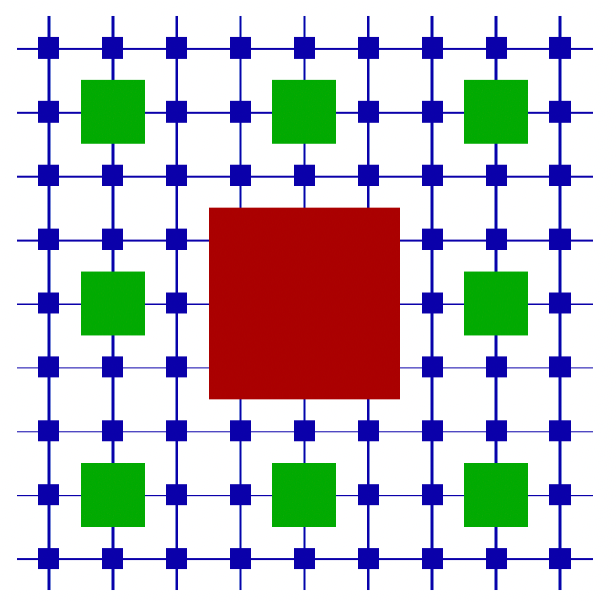

# [CactusAMReX](https://bitbucket.org/eschnett/cactusamrex)

**CarpetX** is a [Cactus](https://cactuscode.org/) driver based on [AMReX](https://amrex-codes.github.io), a software framework for block-structured AMR (adaptive mesh refinement). CarpetX is intended for the [Einstein Toolkit](https://einsteintoolkit.org/).

* [Bitbucket](https://bitbucket.org/eschnett/cactusamrex): Source code repository
* [Azure   Pipelines](https://dev.azure.com/schnetter/CactusAMReX/_build): Build Status 
